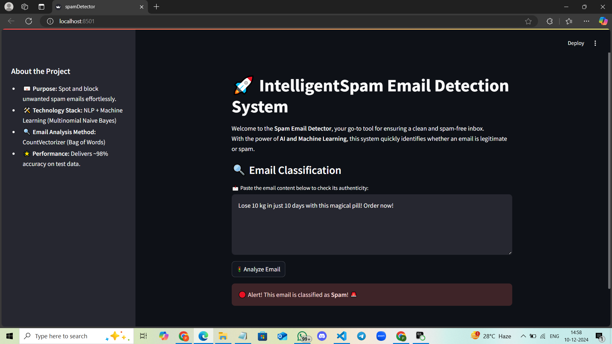
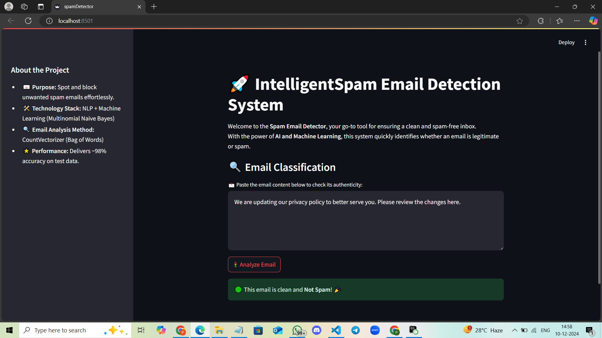

# **P3-Spam-Email-Classification-Using-NLP-And-Machine-Learning**

## **Description**
Intelligent Spam Email Detection System is a smart tool designed to classify emails as spam or non-spam. Powered by Natural Language Processing and Machine Learning, it helps detect and block unwanted emails with ease. With a streamlined approach and ~98% accuracy, this project simplifies email filtering for a hassle-free experience.

### **Why this project?**
With the growing volume of email communication, distinguishing between useful messages and spam is crucial. This project leverages state-of-the-art techniques to deliver accurate and reliable spam detection.

---

## **Features**

- 🔍 **Accurate Spam Detection**: Classifies emails as spam or non-spam with ~98% accuracy.
- 📊 **Advanced NLP Techniques**: Uses CountVectorizer and Bag-of-Words for effective text representation.
- 🚀 **Fast and Lightweight**: Optimized for quick predictions using a Multinomial Naive Bayes classifier.
- 🌐 **Interactive Interface**: A user-friendly Streamlit web app to test email classifications.
- 🧠 **Customizable**: Easily retrain the model with new datasets to adapt to evolving spam patterns.
- 🛠️ **Open Source**: Fully customizable and available for further development and contributions.

---

## **Setup and Installation**

### **Step-by-Step Installation**

1. **Download and Install Anaconda**
   - Go to the [official Anaconda website](https://www.anaconda.com/) and download the installer for your operating system.
   - Follow the installation instructions provided by Anaconda.

2. **Create a Virtual Environment**
   - Open your terminal or Anaconda Prompt and run:
     ```bash
     conda create --name spam-classifier-env python=3.8
     ```
   - Activate the newly created environment:
     ```bash
     conda activate spam-classifier-env
     ```

3. **Clone the Repository**
   - Clone the project repository to your local machine:
     ```bash
     git clone https://github.com/your-repo/P3-Spam-Email-Classification.git
     ```
   - Navigate into the project directory:
     ```bash
     cd P3-Spam-Email-Classification
     ```

4. **Install Required Libraries**
   - Use `requirements.txt` to install the necessary libraries:
     ```bash
     pip install -r requirements.txt
     ```
   - The `requirements.txt` should include essential libraries like:
     - `numpy`
     - `pandas`
     - `scikit-learn`
     - `streamlit`

5. **Open the Project in VS Code**
   - Open VS Code and ensure the Anaconda environment (`spam-classifier-env`) is activated for the workspace.

6. **Run Jupyter Notebooks**
   - Execute the notebooks one by one to preprocess data and train the model:
     - Open the notebook files in VS Code or Jupyter Notebook.
     - Run the cells sequentially to complete data preparation and training.

7. **Run the Streamlit App**
   - Launch the spam detection app with Streamlit:
     ```bash
     streamlit run spamdetector.py
     ```

---

## **Usage**

### **Running the Project**
1. Run the Jupyter notebooks one by one within VS Code or Jupyter to process and analyze the data.
2. After completing the notebook execution, use Streamlit to launch the spam detector app:
   ```bash
   streamlit run spamdetector.py

### **Example Output**
Below is a screenshot of the spam detector in action:



